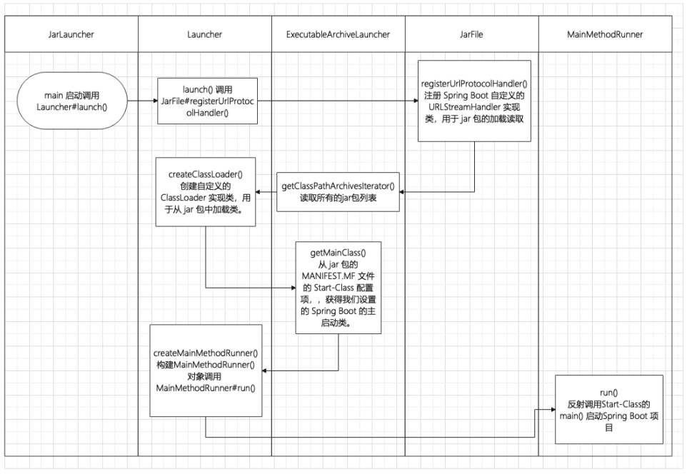
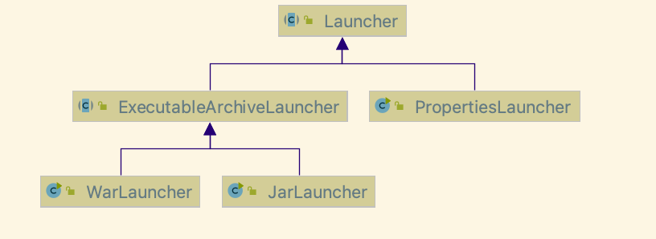

可能很多初学者会比较困惑，Spring Boot 是如何做到将应用代码和所有的依赖打包成一个独立的 Jar 包，因为传统的 Java 项目打包成 Jar 包之后，需要通过 -classpath 属性来指定依赖，才能够运行。我们今天就来分析讲解一下 Spring Boot 的启动原理。
<!--more-->

### 1. Spring Boot 打包插件

Spring Boot 提供了一个名叫 `spring-boot-maven-plugin` 的 maven 项目打包插件，可以方便的将 Spring Boot 项目打成 jar 包。 这样我们就不再需要部署 Tomcat 、Jetty等之类的 Web 服务器容器啦。

我们先看一下 Spring Boot 打包后的结构是什么样的，打开 target 目录我们发现有两个jar包：

>1. hello-0.0.1-SNAPSHOT.jar：17.3MB
>2. hello-0.0.1-SNAPSHOT.jar.original：3KB
   
其中，hello-0.0.1-SNAPSHOT.jar 是通过 Spring Boot 提供的打包插件采用新的格式打成 Fat Jar，包含了所有的依赖；而 hello-0.0.1-SNAPSHOT.jar.original 则是Java原生的打包方式生成的，仅仅只包含了项目本身的内容。

### 2. SpringBoot FatJar 的组织结构

我们将 Spring Boot 打的可执行 Jar 展开后的结构如下所示：

```shell
.
├── BOOT-INF
│   ├── classes
│   │   ├── application.properties
│   │   └── com
│   │       └── javanorth
│   │           └── hello
│   │               └── HelloApplication.class
│   └── lib
│       ├── spring-boot-2.5.0.RELEASE.jar
│       ├── spring-boot-autoconfigure-2.5.0.RELEASE.jar
│       ├── spring-boot-configuration-processor-2.5.0.RELEASE.jar
│       ├── spring-boot-starter-2.5.0.RELEASE.jar
│       ├── ...
├── META-INF
│   ├── MANIFEST.MF
│   └── maven
│       └── com.javanorth
│           └── hello
│               ├── pom.properties
│               └── pom.xml
│   
├── org
│   └── springframework
│       └── boot
│           └── loader
│               ├── ExecutableArchiveLauncher.class
│               ├── JarLauncher.class
│               ├── Launcher.class
│               ├── MainMethodRunner.class
│               ├── ...
```

- BOOT-INF目录：包含了我们的项目代码（classes目录），以及所需要的依赖（lib 目录）
- META-INF目录：通过 MANIFEST.MF 文件提供 Jar包的元数据，声明了 jar 的启动类
- `org.springframework.boot.loader` ：Spring Boot 的加载器代码，实现的 Jar in Jar 加载的魔法源

我们看到，如果去掉BOOT-INF目录，这将是一个非常普通且标准的Jar包，包括元信息以及可执行的代码部分，其/META-INF/MAINFEST.MF指定了Jar包的启动元信息，`org.springframework.boot.loader` 执行对应的逻辑操作。

### 3. MAINFEST.MF 元信息分析

元信息内容如下所示：

```shell
Manifest-Version: 1.0
Created-By: Maven Jar Plugin 3.2.0
Build-Jdk-Spec: 11
Implementation-Title: hello
Implementation-Version: 0.0.1-SNAPSHOT
Main-Class: org.springframework.boot.loader.JarLauncher
Start-Class: com.javanorth.hello.HelloApplication
Spring-Boot-Version: 2.5.0
Spring-Boot-Classes: BOOT-INF/classes/
Spring-Boot-Lib: BOOT-INF/lib/
Spring-Boot-Classpath-Index: BOOT-INF/classpath.idx
Spring-Boot-Layers-Index: BOOT-INF/layers.idx
```

它相当于一个 Properties 配置文件，每一行都是一个配置项目。重点来看看两个配置项：
- Main-Class 配置项：Java 规定的 jar 包的启动类，这里设置为 spring-boot-loader 项目的 JarLauncher 类，进行 Spring Boot 应用的启动。
- Start-Class 配置项：Spring Boot 规定的主启动类，这里设置为我们定义的 Application 类。
- Spring-Boot-Classes 配置项：指定加载应用类的入口
- Spring-Boot-Lib 配置项: 指定加载应用依赖的库

### 4. 启动原理

Spring Boot 的启动原理如下图所示：



### 5. 源码分析

#### org.springframework.boot.loader.JarLauncher

JarLauncher 类是针对 Spring Boot jar 包的启动类， 完整的类图如下所示：



其中的 WarLauncher 类，是针对 Spring Boot war 包的启动类。 启动类 `org.springframework.boot.loader.JarLauncher` 并非为项目中引入类，而是 `spring-boot-maven-plugin` 插件 repackage 追加进去的。
接下来我们先来看一下 JarLauncher 的源码，比较简单，如下图所示：

```java
public class JarLauncher extends ExecutableArchiveLauncher {
    private static final String DEFAULT_CLASSPATH_INDEX_LOCATION = "BOOT-INF/classpath.idx";
    static final EntryFilter NESTED_ARCHIVE_ENTRY_FILTER = (entry) -> {
        if (entry.isDirectory()) {
            return entry.getName().equals("BOOT-INF/classes/");
        }
        return entry.getName().startsWith("BOOT-INF/lib/");
    };
    public JarLauncher() {
    }
    protected JarLauncher(Archive archive) {
        super(archive);
    }
    @Override
    protected ClassPathIndexFile getClassPathIndex(Archive archive) throws IOException {
        // Only needed for exploded archives, regular ones already have a defined order
        if (archive instanceof ExplodedArchive) {
            String location = getClassPathIndexFileLocation(archive);
            return ClassPathIndexFile.loadIfPossible(archive.getUrl(), location);
        }
        return super.getClassPathIndex(archive);
    }
    private String getClassPathIndexFileLocation(Archive archive) throws IOException {
        Manifest manifest = archive.getManifest();
        Attributes attributes = (manifest != null) ? manifest.getMainAttributes() : null;
        String location = (attributes != null) ? attributes.getValue(BOOT_CLASSPATH_INDEX_ATTRIBUTE) : null;
        return (location != null) ? location : DEFAULT_CLASSPATH_INDEX_LOCATION;
    }
    @Override
    protected boolean isPostProcessingClassPathArchives() {
        return false;
    }
    @Override
    protected boolean isSearchCandidate(Archive.Entry entry) {
        return entry.getName().startsWith("BOOT-INF/");
    }
    @Override
    protected boolean isNestedArchive(Archive.Entry entry) {
        return NESTED_ARCHIVE_ENTRY_FILTER.matches(entry);
    }
    public static void main(String[] args) throws Exception {
        new JarLauncher().launch(args);
    }
}
```

当执行 `java -jar` 命令或执行解压后的 `org.springframework.boot.loader.JarLauncher` 类时，JarLauncher 会将 BOOT-INF/classes 下的类文件和 BOOT-INF/lib 下依赖的jar加入到classpath下，后调用 META-INF/MANIFEST.MF 文件 Start-Class 属性 [指向项目中的 `com.javanorth.hello.HelloApplicatioin` 启动类] 完成应用程序的启动。

JarLauncher 假定依赖项jar包含在 /BOOT-INF/lib 目录中，并且应用程序类包含在 /BOOT-INF/classes 目录中。它的 main 方法调用的则是基类 Launcher 定义的 launch 方法，而 Launcher 是ExecutableArchiveLauncher 的父类。

#### org.springframework.boot.loader.ExecutableArchiveLauncher

ExecutableArchiveLauncher 是 JarLauncher 的直接父类，继承了 Launcher 基类，并实现部分抽象方法
```java
public abstract class ExecutableArchiveLauncher extends Launcher {
    private static final String START_CLASS_ATTRIBUTE = "Start-Class";
    protected static final String BOOT_CLASSPATH_INDEX_ATTRIBUTE = "Spring-Boot-Classpath-Index";
    private final Archive archive;
    private final ClassPathIndexFile classPathIndex;
    public ExecutableArchiveLauncher() {
        try {
            this.archive = createArchive();
            this.classPathIndex = getClassPathIndex(this.archive);
        }
        catch (Exception ex) {
            throw new IllegalStateException(ex);
        }
    }
    protected ExecutableArchiveLauncher(Archive archive) {
        try {
            this.archive = archive;
            this.classPathIndex = getClassPathIndex(this.archive);
        }
        catch (Exception ex) {
            throw new IllegalStateException(ex);
        }
    }
    protected ClassPathIndexFile getClassPathIndex(Archive archive) throws IOException {
        return null;
    }
    @Override
    protected String getMainClass() throws Exception {
        Manifest manifest = this.archive.getManifest();
        String mainClass = null;
        if (manifest != null) {
            mainClass = manifest.getMainAttributes().getValue(START_CLASS_ATTRIBUTE);
        }
        if (mainClass == null) {
            throw new IllegalStateException("No 'Start-Class' manifest entry specified in " + this);
        }
        return mainClass;
    }
    @Override
    protected ClassLoader createClassLoader(Iterator<Archive> archives) throws Exception {
        List<URL> urls = new ArrayList<>(guessClassPathSize());
        while (archives.hasNext()) {
            urls.add(archives.next().getUrl());
        }
        if (this.classPathIndex != null) {
            urls.addAll(this.classPathIndex.getUrls());
        }
        return createClassLoader(urls.toArray(new URL[0]));
    }
    private int guessClassPathSize() {
        if (this.classPathIndex != null) {
            return this.classPathIndex.size() + 10;
        }
        return 50;
    }
    @Override
    protected Iterator<Archive> getClassPathArchivesIterator() throws Exception {
        Archive.EntryFilter searchFilter = this::isSearchCandidate;
        Iterator<Archive> archives = this.archive.getNestedArchives(searchFilter,
                (entry) -> isNestedArchive(entry) && !isEntryIndexed(entry));
        if (isPostProcessingClassPathArchives()) {
            archives = applyClassPathArchivePostProcessing(archives);
        }
        return archives;
    }
    private boolean isEntryIndexed(Archive.Entry entry) {
        if (this.classPathIndex != null) {
            return this.classPathIndex.containsEntry(entry.getName());
        }
        return false;
    }
    private Iterator<Archive> applyClassPathArchivePostProcessing(Iterator<Archive> archives) throws Exception {
        List<Archive> list = new ArrayList<>();
        while (archives.hasNext()) {
            list.add(archives.next());
        }
        postProcessClassPathArchives(list);
        return list.iterator();
    }
    protected boolean isSearchCandidate(Archive.Entry entry) {
        return true;
    }
    protected abstract boolean isNestedArchive(Archive.Entry entry);
    protected boolean isPostProcessingClassPathArchives() {
        return true;
    }
    protected void postProcessClassPathArchives(List<Archive> archives) throws Exception {
    }
    @Override
    protected boolean isExploded() {
        return this.archive.isExploded();
    }
    @Override
    protected final Archive getArchive() {
        return this.archive;
    }
}
```

#### org.springframework.boot.loader.Launcher

如下则是 Launcher 的源码

1. launch 方法会首先创建类加载器，而后判断是否 jar 是否在 MANIFEST.MF 文件中设置了 jarmode 属性。
2. 如果没有设置，launchClass 的值就来自 getMainClass() 返回，该方法由子类实现，返回 MANIFEST.MF 中配置的 START_CLASS_ATTRIBUTE 属性值
3. 调用 createMainMethodRunner 方法，构建一个 MainMethodRunner 对象并调用其 run 方法

>jarmode 是创建 docker 镜像时用到的参数，使用该参数是为了生成带有多个 layer 信息的镜像，这里暂不注意

```java
public abstract class Launcher {
    private static final String JAR_MODE_LAUNCHER = "org.springframework.boot.loader.jarmode.JarModeLauncher";
    protected void launch(String[] args) throws Exception {
        if (!isExploded()) {
            JarFile.registerUrlProtocolHandler();
        }
        ClassLoader classLoader = createClassLoader(getClassPathArchivesIterator());
        String jarMode = System.getProperty("jarmode");
        String launchClass = (jarMode != null && !jarMode.isEmpty()) ? JAR_MODE_LAUNCHER : getMainClass();
        launch(args, launchClass, classLoader);
    }
    @Deprecated
    protected ClassLoader createClassLoader(List<Archive> archives) throws Exception {
        return createClassLoader(archives.iterator());
    }
    protected ClassLoader createClassLoader(Iterator<Archive> archives) throws Exception {
        List<URL> urls = new ArrayList<>(50);
        while (archives.hasNext()) {
            urls.add(archives.next().getUrl());
        }
        return createClassLoader(urls.toArray(new URL[0]));
    }
    protected ClassLoader createClassLoader(URL[] urls) throws Exception {
        return new LaunchedURLClassLoader(isExploded(), getArchive(), urls, getClass().getClassLoader());
    }
    protected void launch(String[] args, String launchClass, ClassLoader classLoader) throws Exception {
        Thread.currentThread().setContextClassLoader(classLoader);
        createMainMethodRunner(launchClass, args, classLoader).run();
    }
    protected MainMethodRunner createMainMethodRunner(String mainClass, String[] args, ClassLoader classLoader) {
        return new MainMethodRunner(mainClass, args);
    }
    protected abstract String getMainClass() throws Exception;
    protected Iterator<Archive> getClassPathArchivesIterator() throws Exception {
        return getClassPathArchives().iterator();
    }
    @Deprecated
    protected List<Archive> getClassPathArchives() throws Exception {
        throw new IllegalStateException("Unexpected call to getClassPathArchives()");
    }
    protected final Archive createArchive() throws Exception {
        ProtectionDomain protectionDomain = getClass().getProtectionDomain();
        CodeSource codeSource = protectionDomain.getCodeSource();
        URI location = (codeSource != null) ? codeSource.getLocation().toURI() : null;
        String path = (location != null) ? location.getSchemeSpecificPart() : null;
        if (path == null) {
            throw new IllegalStateException("Unable to determine code source archive");
        }
        File root = new File(path);
        if (!root.exists()) {
            throw new IllegalStateException("Unable to determine code source archive from " + root);
        }
        return (root.isDirectory() ? new ExplodedArchive(root) : new JarFileArchive(root));
    }
    protected boolean isExploded() {
        return false;
    }
    protected Archive getArchive() {
        return null;
    }
}
```

#### org.springframework.boot.loader.MainMethodRunner

从名字可以判断这是一个目标类main方法的执行器，此时的 mainClassName 被赋值为 MANIFEST.MF 中配置的 START_CLASS_ATTRIBUTE 属性值，也就是 `com.javanorth.hello.HelloApplication`，之后便是通过反射执行 HelloApplication 的 main 方法，从而达到启动 Spring Boot 的效果。

```java
public class MainMethodRunner {
    private final String mainClassName;
    private final String[] args;
    public MainMethodRunner(String mainClass, String[] args) {
        this.mainClassName = mainClass;
        this.args = (args != null) ? args.clone() : null;
    }
    public void run() throws Exception {
        Class<?> mainClass = Class.forName(this.mainClassName, false, Thread.currentThread().getContextClassLoader());
        Method mainMethod = mainClass.getDeclaredMethod("main", String[].class);
        mainMethod.setAccessible(true);
        mainMethod.invoke(null, new Object[] { this.args });
    }
}
```

### 总结

1. jar 包类似于 zip 压缩文件，只不过相比 zip 文件多了一个 META-INF/MANIFEST.MF 文件，该文件在构建 jar 包时自动创建
2. 想要制作可执行 JAR 包，在 MANIFEST.MF 中指定 Main-Class 是关键。使用 java 执行 jar 包的时候，实际上等同于使用 java 命令执行指定的 Main-Class 程序。
3. Spring Boot 提供了一个插件 spring-boot-maven-plugin ，用于把程序打包成一个可执行的jar包
4. 使用 java -jar 启动 Spring Boot 的 jar 包，首先调用的入口类是 JarLauncher，内部调用 Launcher 的 launch 后构建 MainMethodRunner 对象，最终通过反射调用 HelloApplication 的 main 方法实现启动效果。
   
[EOF]